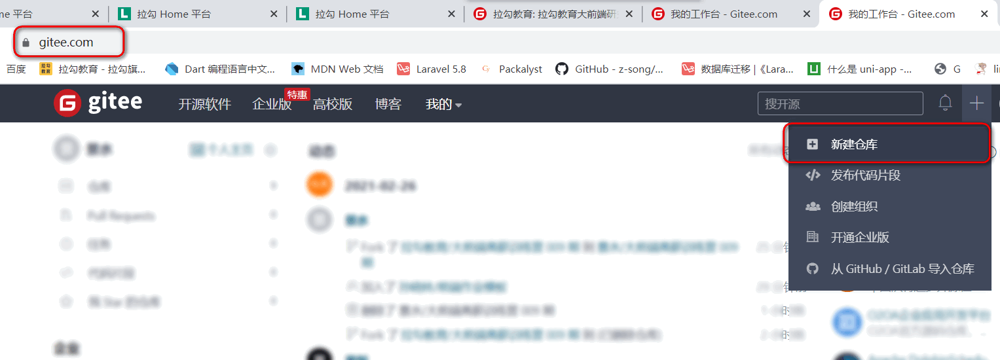
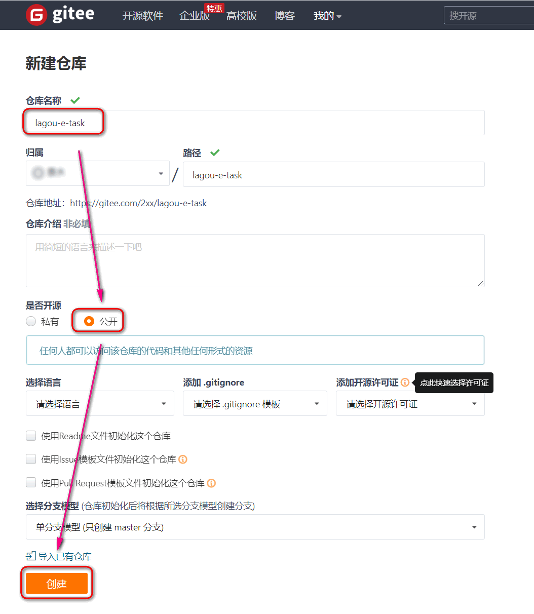
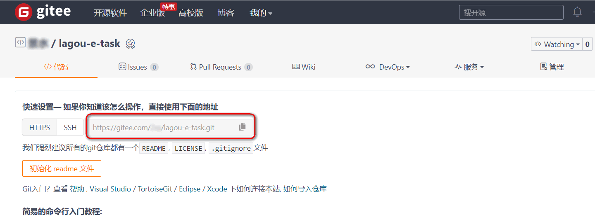
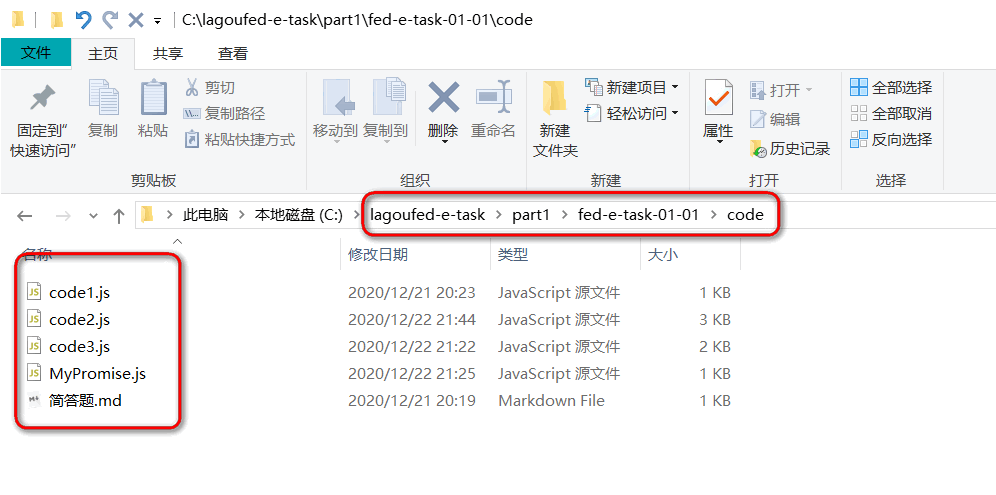
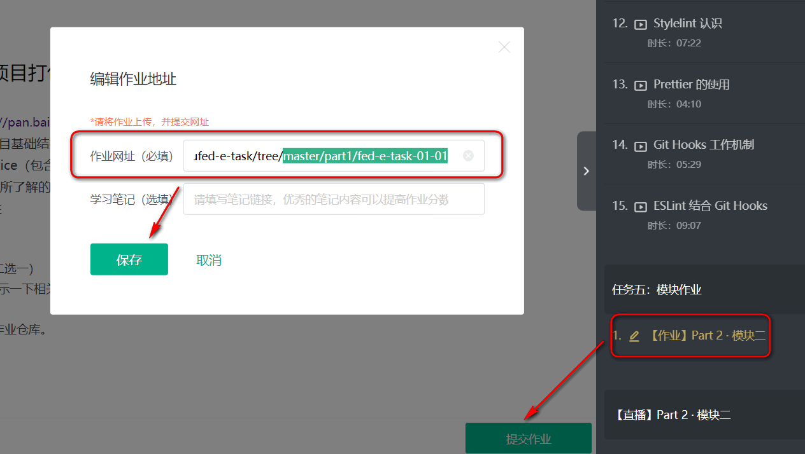

# 拉勾教育大前端高薪训练营作业

　

[**-- 视频讲解 --**](https://www.bilibili.com/video/BV1aq4y1Q72y)

　

## 一、创建作业仓库

#### 1.注册登录 gitee 后. 克隆作业模板

地址：https://gitee.com

(不要复制 $ 符号)

```
$ git clone https://gitee.com/lagoufed/lagoufed-e-task.git
```


#### 2.在 gitee 创建自己的作业仓库, 并拿到仓库地址

( **需要先注册账户**。推荐 gitee，国内相对稳定一些，github账户也可直接登录 )






**拿到仓库地址**



　

#### 3.本地仓库与远程仓库关联

```shell
# 1)进入目录
$ cd lagoufed-e-task

# 2)生成本地仓库
$ git init

# 3)生成一个提交
$ git add .
$ git commit -m "init"

# 4)关联到远程空库     https:// .... 是自己的远程仓库地址
$ git remote add origin https://gitee.com/xxx/lagou-e-task.git

# 5)把本地仓库代码推送到远程仓库
$ git push origin master
```

　


## 二、正式写作业

#### 1.在本地代码仓库中完成作业



#### 2.完成作业. 保存版本. 推送到远程仓库.

```shell
$ git add .
$ git commit -m "part1-1作业"
$ git push origin master
```

　

#### 3.提交自己仓库相应模块地址即可




